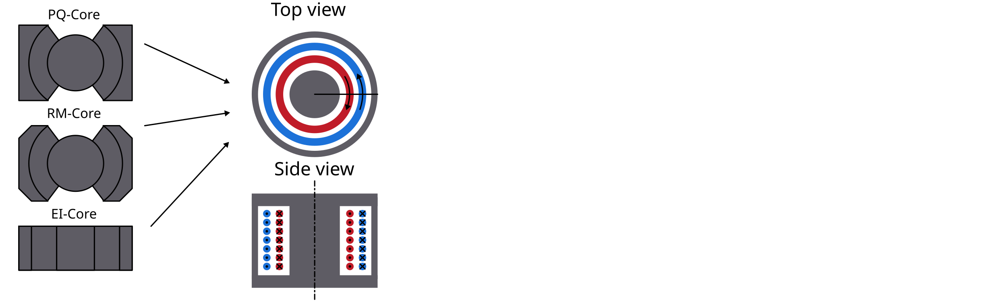

FEM Magnetics Toolbox (FEMMT)
=============================

This README only provides a short overview. For more information please have a look at the detailed documentation `here <https://upb-lea.github.io/FEM_Magnetics_Toolbox/intro.html>`__.

Python toolbox to generate preconfigured figures for FEM simulation tools in power electronics.

The toolbox is accessible via python code or a graphical user interface
(GUI), which current development status is experimental.

All core shapes are simulated as 2D symmetric cores, as shown in the figure.

|geometry_translated|

Overview features
-------------------

Stable features
~~~~~~~~~~~~~~~~~

* Component features:
    * 2D axi-symmetric cylindrical simplification
    * `Inductor </femmt/examples/basic_inductor.py>`__, `2-winding transformer </femmt/examples/basic_transformer.py>`__, `n-winding transformer </femmt/examples/basic_transformer_6_windings.py>`__
    * Arbitrary (distributed) air gap positioning in center leg
    * Variety of winding interleaving schemes
    * Special geometries:
        * `Center tapped transformer </femmt/examples/basic_transformer_center_tapped.py>`__
        * `Magnetic shunt </femmt/examples/basic_transformer_integrated.py>`__ (transformer with integrated inductor)
        * `Stacked core </femmt/examples/basic_transformer_stacked.py>`__ (transformer with integrated inductor)
    * Round litz wire
    * Round and rectangular solid wires
    * Different winding schemes (hexagonal, left/right, top/down, ...)
    * Parallel connection of solid wires
    * Insulation distances (winding2core, winding2winding)
    * Many `examples </femmt/examples/>`__ to learn and understand FEMMT
    * Databases
         * Litz wire database
         * Core geometry database
         * Conductor materials: temperature curves
         * Ferrit materials: permeability / permittivity `material database <https://github.com/upb-lea/materialdatabase>`__ (datasheets and own measurements)

* Solver features:
    * Implemented using `ONELAB <https://onelab.info/>`__
    * Current excitation
    * Frequency domain solver
    * Litz wire loss model for proximity and skin effect (Niyomsatian et al.: Frequency-domain homogenization for impedance characterization of litz-wire transformers in 2-D finite element models)
    * Core loss calculation for real materials (data from material database)
        * Amplitude dependent loss angle (Local resolution of complex permeability)
        * Equivalent permittivity data for eddy current calculations
        * Effect of dimensional resonance is considered
    * Thermal solver
        * Thermal conduction (Poisson equation)
        * Fixed temperature and isolation boundary conditions
        * Verified model for potted core

* Pre/Post processing:
    * Linear eddy current analysis via input current based FFT
    * Pre-visualization of ferrite material (measurement) data interpolation
    * Field visualization in gmsh GUI (magnetic flux density, eddy current losses, ...)
    * Inductance matrix for n-winding transformer
    * Transformer equivalent diagrams for 2- and 3-winding transformer

* Optimization:
    * Parallel computing to speed up simulations (no cpu core limitation)
    * Examples for Pareto optimization to adapt to your own optimization problem

Experimental features (under development)
~~~~~~~~~~~~~~~~~~~~~~~~~~~~~~~~~~~~~~~~~

* Component features:
    * Reluctance module is currently working for a single optimization example and not fully implemented yet.
* Solver features:
    * Time domain solver
* Optimization:
    * Advanced optimization algorithms by connecting to `optuna <https://github.com/optuna/optuna>`__
* GUI:
    * Experimental in general

Planned features (Roadmap for 202x)
~~~~~~~~~~~~~~~~~~~~~~~~~~~~~~~~~~~~~~~~~
* Solver features:
    * Core loss calculation from non-sinusoidal flux
    * Local temperature dependency (currently only lumped temperature assignment, e.g. general temperature for all windings)

Not supported features
~~~~~~~~~~~~~~~~~~~~~~~~~~~~~~~~~~~~~~~~~
* Not supported component features:
    * Toroidal core

* Not supported solver features:
    * Voltage excitation

Documentation
-------------------
Please have a look at the `documentation <https://upb-lea.github.io/FEM_Magnetics_Toolbox/intro.html>`__. You will find tutorials and a function description.

Installation
---------------

To run FEMMT python (version 3.10 or above) and onelab is needed.

ONELAB installation
~~~~~~~~~~~~~~~~~~~~~~~

-  Go to https://onelab.info/
-  Download the Desktop Version for your OS (Windows, Linux or macOS)
-  Unpack the software and remember the file path. This will be needed
   later when installing FEMMT.

Install FEMMT
~~~~~~~~~~~~~~~~~

FEMMT can be installed using the python pip package manager.
This is the stable release version (recommended).

::

   pip install femmt

For working with the latest version, refer to the `documentation <https://upb-lea.github.io/FEM_Magnetics_Toolbox/intro.html>`__.

Minimal example
------------------

This toolbox is able to build a complete FEM simulation from simple
Python code. The following figure shows the Python code on the left and
the corresponding FEM simulation on the right. |FEMMT_Screenshot|

To run a minimal example please have a look at the `examples </femmt/examples/>`__.

GUI (Experimental)
-------------------

There is a first preview for a GUI. Installing this is a bit cumbersome
at first, but will be simplified in the future:

* Download the complete repository via ``Code`` -> ``Download ZIP`` and unpack it.
* Or clone the repository
* Install the development version of femmt using ``pip install -e .``
* Run python ``.../path-to_femmt/femmt/gui/femmt_gui.py``

Please note, the GUI is experimental.

|femmt_gui_definition|

Troubleshooting
-------------------
If the working directory is within OneDrive, there are problems writing .dat files, which are basic for FEMMT. The following error messages appear:

::

    FileNotFoundError: [Errno 2] No such file or directory: your_directory/femmt/electro_magnetic/Strands_Coefficients/coeff/pB_RS_la0.6_4layer.dat
    FileNotFoundError: [Errno 2] No such file or directory: your_directory/results/values/j2F_1.dat

The solution is to place the working directory of FEMMT including the Python virtual environment outside the OneDrive folder.

Bug Reports
--------------

Please use the issues report button within github to report bugs.

Contributing
---------------

Pull requests are welcome. For major changes, please open an issue first
to discuss what you would like to change. For contributing, please refer
to this `section <Contributing.rst>`__.

Changelog
------------

Find the changelog `here <CHANGELOG.md>`__.

License
----------

`GPLv3 <https://choosealicense.com/licenses/gpl-3.0/>`__

History and project status
------------------------------

This project was initially written in matlab using FEMM simulation tool.
It became clear that the project was no longer a small project. The
project should be completely rewritten, because many new complex levels
have been added. To place the project in the open source world, the
programming language python is used.

.. |FEMMT_Screenshot| image:: docs/images/FEMMT_Screenshot.png
.. |femmt_gui_definition| image:: docs/images/femmt_gui_definition.png
.. |counting_arrow_system| image:: docs/images/counting_arrow_system.png
