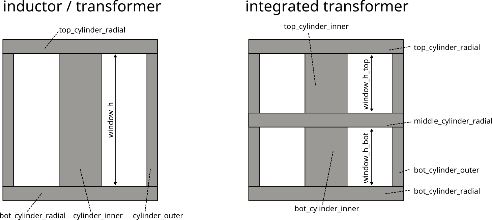
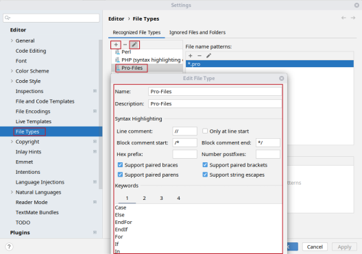

Developer Notes for FEMMT
===========================

This chapter contains some useful information when developing with femmt.

Variable naming
----------------

The variable naming is defined as shown in this section. Note that the names should be as given here. **No acronyms**, like ``f`` or ``freq`` **for** ``frequency``.

|geometry_core_developer_notes|
|geometry_core_naming_convention|

Geometry variables
###################
* ``core_inner_diameter``: core inner diameter
* ``window_w``: width of winding window
* ``winding_h``: height of winding window
* ``r_inner``: core_inner_diameter / 2 + winding_w
* ``r_outer``: core outer radius, calculated by software for same cross-section as inner cylinder
 
Additional variables for integrated transformer
* ``window_h_top``: height of top winding window
* ``window_h_bot``: height of bottom winding window

currents, temperature
#####################
* ``temperature``: temperature (Do **not** use ``T``, ``temp``, ...)
* ``frequency``: frequency (Do **not** use ``f``, ``freq``, ...)

Material variables
###################
* ``mu_r_abs``: absolute value of mu_r
* ``mu_r_real``: real part of mu_r
* ``mu_r_imag``: imaginary part of mu_r

Winding creation
-----------------

Since there are multiple possible virtual winding windows containing currently up to 2 conductors it is necessary to have a global order for every conductor.
This order is set by the winding_number which is given to the Conductor on creation.
This results in multiple lists containg the same conductor objects (called windings) in different objects:

1. Every virtual winding window contains a list of conductors. This list either contains one conductor (single winding) or two conductors (interleaved winding). When setting the interleaved winding the order of conductors is given by the order of the parameters. First given winding -> winding[0], second given winding -> winding[1].
2. The magnetic component contains a list of conductors too. This list contains every unique conductor from every virtual winding window. The order of the windings list in magnetic component is given by the winding_number (sorted in ascending order). This means that the conductor with the lowest winding_number is at position 0 of the winding list: windings[0].

Example:

2 conductors are created: Conductor0(winding_index=0) and Conductor1(winding_index=1). Additionaly 2 virtual winding windows are created.
The first virtual winding window only contains Conductor0, the second virtual winding window contains both conductors.
The following winding lists are created:

- VirtualWindingWindow0: windings = [Conductor0]
- VirtualWindingWindow1: windings = [Conductor0, Conductor1]
- MagneticComponent: windings = [Conductor0, Conductor1]

If Conductor1 has a lower winding_index than Conductor0 only the list in magnetic component would change since it does not change
the parameter order for setInterleavedWinding() in VirtualWindingWindow1:

- MagneticComponent: windings = [Conductor1, Conductor0]

The order of the conductors in the magnetic component windings list is very important for the simulation.
When creating the model and running the simulation the order of the conductors in MagneticComponent.windings is used to determine
if the conductor is the primary, secondary (, tertiary, ...) winding.

In the TwoDaxiSymmetric class points for every conductor are created. Those points are stored in a list called p_conductor.
p_conductor[0] is a list containing the points for every turn of the conductor with the lowest winding_index (primary winding).
p_conductors[1] is a list containing the points for every turn of the conductor with the second lowest winding_index (secondary winding).

Currently the magnetic solver only supports primary and secondary windings, therefore it is useless to create more conductors.
However the implemented structure is capable of working with n windings.

General file overview
---------------------

* ``.pro``: solver files for communication between python and the solver
* ``.pos``: field results
* ``.dat``: integrated field results
* ``.msh``: mesh files

Recommended Pycharm settings
---------------------------------------------------------------

Exclude simulation directory from indexing
#########################################################

Especially when performing Pareto optimizations in the example directory, Pycharm gets slow during indexing. To avoid this, you can use another directory or exclude the ``example_results`` direcory from the project, as shown in the following steps:
``File`` -> ``Settings`` -> ``project structure``, select the folders you need (e.g. ``femmt/examples/example_results``, ``right click`` and click ``exlcuded``.

Pycharm code highlightning for pro-files
#########################################################

|image_pycharm_configuration_pro_files|

.. |geometry_core_developer_notes| image:: ../images/geometry_core_developer_notes.png

