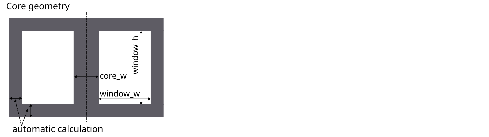
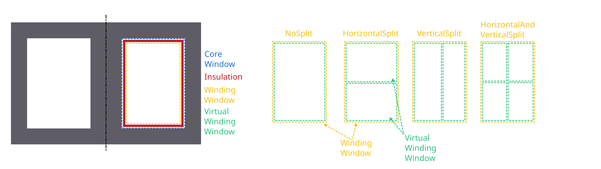
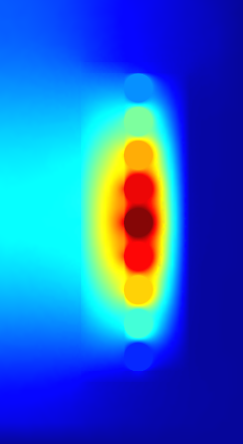

User Guide: How to create a FEMMT model
=======================================

This guide explains how a model can be created in femmt and provides all
the necessary information to work with femmt. Many examples for femmt
models can be found in the example folder.

Working directory
--------------------

Every femmt model has a working directory which can be set when creating
an instance of the femmt base class called ``MagneticComponent``. When
running the simulation many files will be created in the working
directory including the model, mesh and multiple result files. It also
contains the electro_magnetic_log.json which the most important
simulation results (e.g. losses, inductance, ...).

Besides the working directory a ``MagneticComponent`` also needs a
``ComponentType``. Currently this can be '``Inductor``', '``Transformer``' or
'``IntegratedTransformer``'.

This results to the following code:

.. code:: python

   import femmt as fmt

   geo = fmt.MagneticComponent(simulation_type=fmt.SimulationType.FreqDomain,
                                component_type=fmt.ComponentType.Transformer, working_directory=working_directory,
                                verbosity=fmt.Verbosity.ToConsole, is_gui=is_test)

The ``simulation_type`` specifies the type of simulation to be performed.

- If set to ``FreqDomain``, indicating a frequency domain simulation.
- If set to ``TimeDomain``, indicating a time domain simulations.

The ``Verbosity`` controls the level of detail in the output.

- If set to ``ToConsole``, all output messages are shown in the commend line .
- If set to ``ToFile``, all output messages are written to files.
- If set to ``Silent``, no command line outputs are shown.

This simple feature significantly speeds up simulation time, especially for many automated simulations.

Creating a core
------------------

In general, only 2D rotationally symmetric geometries are represented in
FEMMT. Other core shapes must first be converted to a 2D rotationally
symmetric shape. The corresponding values for this (diameter core,
dimensions of the winding window) are taken from the data sheet.
Afterwards, a corresponding geometry is generated automatically.

The following graphics always show only a sectional view of the core
geometry.

.. image:: ../images/geometry_translated.png
    :width: 800

After creating a MagneticComponent, a core needs to be created. The core
needs spatial parameters as well as material parameters. The neccessary
spatial parameters are shown in the image below.

Core spatial parameters can be entered manually but FEMMT provides a
database of different practical cores. This database can be accessed
using:

.. code:: python

   core_db = fmt.core_database()["PQ 40/40"]

Now the core object can be created and added to the model (geo object)

.. code:: python

   core_dimensions = fmt.dtos.SingleCoreDimensions(core_inner_diameter=core_db["core_inner_diameter"],
                                                    window_w=core_db["window_w"],
                                                    window_h=core_db["window_h"],
                                                    core_h=core_db["core_h"])

   core = fmt.Core(core_type=fmt.CoreType.Single,
                    core_dimensions=core_dimensions,
                    detailed_core_model=False,
                    material=mdb.Material.N49, temperature=45, frequency=inductor_frequency,
                    permeability_datasource=fmt.MaterialDataSource.Measurement,
                    permeability_datatype=fmt.MeasurementDataType.ComplexPermeability,
                    permeability_measurement_setup=mdb.MeasurementSetup.LEA_LK,
                    permittivity_datasource=fmt.MaterialDataSource.Measurement,
                    permittivity_datatype=fmt.MeasurementDataType.ComplexPermittivity,
                    permittivity_measurement_setup=mdb.MeasurementSetup.LEA_LK, mdb_verbosity=fmt.Verbosity.Silent)
   geo.set_core(core)

Material database
~~~~~~~~~~~~~~~~~

The `material database <https://github.com/upb-lea/materialdatabase>`_ was already introduced in the upper code example with the `material=` parameter. The temperature as well as the frequency are necessary to pick the corresponding data from the datasheet.

Adding air gaps to the core
------------------------------

In the next steps air gaps can be added. Currently it is only possible
to add air gaps in the center leg, there for the 'AirGapLegPosition' is
always 'CenterLeg'. To set the vertical position for a air gap multiple
methods are available:

-  **Center**: The air gap will always be positioned in the center
-  **Percent**: A value between 0 and 100 can be given. Where 0
   represents the bottom end and 100 the top end of the winding window.
-  **Manually**: The specific y-coordinate needs to be entered
   manually.

.. image:: ../images/geometry_air_gap.png
    :width: 800

Have a look at the following example on how to create an air gap object
and add it to the model:

.. code:: python

   air_gaps = fmt.AirGaps(method=fmt.AirGapMethod.Percent, core=core)
   air_gaps.add_air_gap(leg_position=fmt.AirGapLegPosition.CenterLeg, height=0.0005, position_value=50)
   geo.set_air_gaps(air_gaps)

Adding an air_gap object is not necessary. If no air gap is needed,
don't add the air gap object to the model.

Set insulation distances
---------------------------

There are multiple insulations implemented in femmt. Some of them are
created as rectangles in the model, some are just adding an offset to
the windings.

Core insulations are the insulations which are created as rectangles in
the model. 4 core insulations will be added: top, bottom, left, right.
The distance of those values can be set with the ``add_core_insulations``
function. The order of ``add_core_insulations`` is as follow : top, bottom, left, and right.

Furthermore there are offset insulations between each turn in the same
winding, a distance between 2 windings in one virtual winding window and
a distance between each virtual winding window. The first two are set
using the ``add_winding_insulations`` functions, the last one when
creating such a :ref:`virtual-winding-windows-label` (vww).

The ``add_winding_insulations`` contains the inner winding insulation, which is a nested lists representing
the insulations between turns of the same winding. Importantly, these values are not arranged according to the
sequence in which conductors are added to each winding. Instead, the organization is based on the winding number
with conductors sorted in ascending order of these numbers. Thus, the first sublist (index 0) corresponds to
the winding with the lowest number, the second sublist (index 1) to the winding with the next lowest number, and so on.

.. image:: ../images/geometry_insulation.png
    :width: 800

This is how to create an insulation object and add certain insulations:

.. code:: python

   insulation = fmt.Insulation(flag_insulation=True)
   insulation.add_core_insulations(0.001, 0.001, 0.002, 0.001)
   insulation.add_winding_insulations([[0.0002, 0.001],[0.001, 0.0002]])
   geo.set_insulation(insulation)

The spatial parameters for the insulation, as well as for every other
function in FEMMT, are always in SI-Units, in this case metres.

Add windings to the winding window
-------------------------------------

In order to understand the way winding windows work in femmt, the
concept of virtual winding windows must be explained:

Virtual Winding Windows
~~~~~~~~~~~~~~~~~~~~~~~

For every femmt model there is always one winding window, which is a 2D
representation of the 3D rotated winding window. This winding window can
be split into multiple virtual winding windows which are used to draw
the conductors. The ``split_window`` function has multiple ways to split a winding window into:

-  **NoSplit**: Only 1 virtual winding window will be returned and it
   has the same size as the real winding window.
-  **HorizontalSplit**: 2 virtual winding windows will be returned, one
   for the top and one for the bottom part. The height of the splitting
   line can be set using a horizontal_split_factor (value between 0 and
   1)
-  **VerticalSplit**: 2 virtual winding windows will be returned, one
   for the left and one for the right part. The radius (x-coordinate) of
   the splitting line can be set using a vertical_split_factor (value
   between 0 and 1)
-  **HorizontalAndVerticalSplit**: 4 virtual winding windows are
   returned. One for each corner (in the following order): top_left,
   top_right, bottom_left, bottom_right. In this case the horizontal and
   vertical split factors can be used to set the sizes of each grid
   cell.

In addition to that 2 virtual winding windows can be combined to one
(this is not possible for (top_left, bottom_right) or (top_right,
bottom_left) combinations). This is done using the combine_vww()
function of the WindingWindow class.

Each virtual winding window can be filled with either one single winding
or one interleaved winding.

A winding window with only one virtual winding window can be craeted
like this:

.. code:: python

   winding_window = fmt.WindingWindow(core, insulation)
   vww = winding_window.split_window(fmt.WindingWindowSplit.NoSplit)

Additionally, the ``NCellsSplit`` function provides even more flexibility, allowing
the winding window to be split into N columns horizontally. The distance
between the virtual winding windows, horizontal split factors, and the
vertical split factor can be specified. A winding window with 12 columns horizontally can be created like this:

.. code:: python

   winding_window = fmt.WindingWindow(core, insulation)
   cells = winding_window.NCellsSplit(0, [1 / 6, 2 / 6, 3 / 6, 4 / 6, 5 / 6], 0.5)

Furthermore, the ``NHorizontalAndVerticalSplit`` function introduces more advanced splitting capabilities
by allowing the winding window to be split into N columns horizontally,with each having M_N rows (vertically).
Users can specify the positions of borders between columns and rows
to customize the layout of the resulting virtual winding windows. Creating a winding window with three columns,
where the second column is further divided into two rows, can be achieved with the following code:

.. code:: python

    winding_window = fmt.WindingWindow(core, insulation)
    cells = winding_window.NHorizontalAndVerticalSplit(horizontal_split_factors=[0.48, 0.75],
                                                      vertical_split_factors=[None, [0.5, 0.85], None])

.. _virtual-winding-windows-label:

Winding types and winding schemes
~~~~~~~~~~~~~~~~~~~~~~~~~~~~~~~~~

The following table gives an overview of the different winding types,
winding schemes and conductor arrangements:

+------------------+------------------------+---------------------------+---------------------------+-------------------+------------------+------------------------------------------------------------------------------------+
| **WindingType**  | **ConductorType**      | **WindingScheme**         | **ConductorArrangement**  | **WrapParaType**  | **status**       | **description**                                                                    |
+==================+========================+===========================+===========================+===================+==================+====================================================================================+
| Interleaved      |                        |                           |                           |                   |                  | Always needs 2 conductors                                                          |
+------------------+------------------------+---------------------------+---------------------------+-------------------+------------------+------------------------------------------------------------------------------------+
|                  | RoundSolid, RoundLitz  |                           |                           |                   |                  |                                                                                    |
+------------------+------------------------+---------------------------+---------------------------+-------------------+------------------+------------------------------------------------------------------------------------+
|                  |                        | Bifilar                   |                           |                   | not implemented  | TODO                                                                               |
+------------------+------------------------+---------------------------+---------------------------+-------------------+------------------+------------------------------------------------------------------------------------+
|                  |                        | VerticalAlternating       |                           |                   | not implemented  | primary and secondary winding are interleaved vertically (rows)                    |
+------------------+------------------------+---------------------------+---------------------------+-------------------+------------------+------------------------------------------------------------------------------------+
|                  |                        | HorizontalAlternating     |                           |                   | implemented      | primary and secondary winding are interleaved horizontally (cols)                  |
+------------------+------------------------+---------------------------+---------------------------+-------------------+------------------+------------------------------------------------------------------------------------+
|                  |                        | VerticalStacked           |                           |                   | implemented      | primary winding is drawn bottom to top, seoncdary winmding is drawn top to bottom  |
+------------------+------------------------+---------------------------+---------------------------+-------------------+------------------+------------------------------------------------------------------------------------+
|                  |                        |                           | Square                    |                   | "                |                                                                                    |
+------------------+------------------------+---------------------------+---------------------------+-------------------+------------------+------------------------------------------------------------------------------------+
|                  |                        |                           | Hexagonal                 |                   | "                |                                                                                    |
+------------------+------------------------+---------------------------+---------------------------+-------------------+------------------+------------------------------------------------------------------------------------+
|                  | RectangularSolid       |                           |                           |                   | not implemented  |                                                                                    |
+------------------+------------------------+---------------------------+---------------------------+-------------------+------------------+------------------------------------------------------------------------------------+
| Single           |                        |                           |                           |                   |                  | Always needs 1 conductor                                                           |
+------------------+------------------------+---------------------------+---------------------------+-------------------+------------------+------------------------------------------------------------------------------------+
|                  | RoundSolid, RoundLitz  |                           |                           |                   |                  |                                                                                    |
+------------------+------------------------+---------------------------+---------------------------+-------------------+------------------+------------------------------------------------------------------------------------+
|                  |                        | None                      |                           |                   | implemented      |                                                                                    |
+------------------+------------------------+---------------------------+---------------------------+-------------------+------------------+------------------------------------------------------------------------------------+
|                  |                        |                           | Square                    |                   | "                |                                                                                    |
+------------------+------------------------+---------------------------+---------------------------+-------------------+------------------+------------------------------------------------------------------------------------+
|                  |                        |                           | Square full width         |                   | "                |                                                                                    |
+------------------+------------------------+---------------------------+---------------------------+-------------------+------------------+------------------------------------------------------------------------------------+
|                  |                        |                           | Hexagonal                 |                   | "                |                                                                                    |
+------------------+------------------------+---------------------------+---------------------------+-------------------+------------------+------------------------------------------------------------------------------------+
|                  | RectangularSolid       |                           |                           |                   |                  |                                                                                    |
+------------------+------------------------+---------------------------+---------------------------+-------------------+------------------+------------------------------------------------------------------------------------+
|                  |                        | Full                      |                           |                   | implemented      | whole virtual winding window contains is filled with one turn                      |
+------------------+------------------------+---------------------------+---------------------------+-------------------+------------------+------------------------------------------------------------------------------------+
|                  |                        | FoilHorizontal (stacked)  |                           |                   | implemented      | foils are very long (x-axis) and drawn along y-axis                                |
+------------------+------------------------+---------------------------+---------------------------+-------------------+------------------+------------------------------------------------------------------------------------+
|                  |                        | Square full width         |                           |                   | not implemented  | foils are drawn along x-axis first and then along y-axis                           |
+------------------+------------------------+---------------------------+---------------------------+-------------------+------------------+------------------------------------------------------------------------------------+
|                  |                        | FoilVertical              |                           |                   | implemented      | foils are very tall (y-axis) and drawn along x-axis                                |
+------------------+------------------------+---------------------------+---------------------------+-------------------+------------------+------------------------------------------------------------------------------------+
|                  |                        |                           |                           | Fixed Thickness   | "                |                                                                                    |
+------------------+------------------------+---------------------------+---------------------------+-------------------+------------------+------------------------------------------------------------------------------------+
|                  |                        |                           |                           | Interpolate       | "                |                                                                                    |
+------------------+------------------------+---------------------------+---------------------------+-------------------+------------------+------------------------------------------------------------------------------------+

ConductorArrangement
^^^^^^^^^^^^^^^^^^^^

-  **Square**: conductors are set in next to each other in a grid
-  **Hexagonal**: similar to square but in this case the conductors
   frpmo the next column slips in the free space between two conductors
   from the first column
-  **Square full width**: conducors are first drawn along x-axis and
   then y-axis

WrapParaType
^^^^^^^^^^^^

-  **Fixed thickness**: TODO
-  **Interpolate**: TODO

Images for the possible winding types can be found :ref:`here <winding_types>`.

Add conductors
-----------------

When creating an instance of the class Conductor a winding number and a
conductivity needs to be given:

The winding number represents the index of the winding (e.g. primary->1,
secondary->2, tertiary->3). As an example: When starting a simulation on
a transformer a current needs to be given, this is done in a list. The
first index of the current's list will be set to the winding with the
lowest winding number, the second index of the list to the winding with
the second lowest winding number and so on.

The conductivity can be set using the Conductivity enum where one of two
possible materials need to be selected:

-  **Copper**
-  **Aluminium**

After creating an conductor object it is necessary to add a conductor to
it. As already shown in the winding types table 3 different conducors
can be set:

-  **RoundSolid**
-  **RoundLitz**
-  **RectangularSolid**

To create a conductor have a look at the following code example:

.. code:: python

   winding1 = fmt.Conductor(winding_number=0, conductivity=fmt.Conductivity.Copper)
   winding1.set_solid_round_conductor(conductor_radius=0.0011, conductor_arrangement=fmt.ConductorArrangement.Square)

Add conductors to virtual winding windows
~~~~~~~~~~~~~~~~~~~~~~~~~~~~~~~~~~~~~~~~~

Now the conductors need to be added to the virtual winding windows with
the corresponding winding type and winding scheme. In this case the
set_winding() or set_interleaved_winding() function needs to be called.
In the set_interleaved_winding() function an insulation distance can
also be set. This value represents the distance between conductors from
the primary and secondary side.

.. code:: python

   vww.set_winding(winding, 14, None, fmt.Align.ToEdges, placing_strategy=fmt.ConductorDistribution.VerticalUpward_HorizontalRightward, zigzag=False)

If you have a look at the winding types and winding schemes table a
winding scheme is not needed when creating a round solid conductor in
single winding. Therefore the value is set to None.

In the configuration of single windings using round solid or litz wire conductors,
the focus is on two main aspects: alignment and how the conductors are placed.

Alignment
^^^^^^^^^

Alignment pertains to how the set of conductors is positioned within the winding window:

- **Align.ToEdges**: Ensures the outermost conductors are close to the winding window's edges.

- **Align.CenterOnHorizontalAxis**: Center the winding along the window's horizontal axis, for balanced distribution.

- **Align.CenterOnVerticalAxis**: Center the winding along the window's vertical axis, for balanced distribution.

Placement Strategies
^^^^^^^^^^^^^^^^^^^^

The strategy for placing conductors is named based on the initial direction and subsequent movement. Examples include:

- **VerticalUpward_HorizontalRightward**: Placement starts at the bottom, moving upward vertically, then shifts rightward horizontally for the next column.

- **VerticalUpward_HorizontalLeftward**: Placement starts at the bottom, moving upward vertically, then shifts leftward horizontally for the next column.

- **VerticalDownward_HorizontalRightward**: Begins placement from the top, moving downward, with a rightward shift for each new column.

- **VerticalDownward_HorizontalLeftward**: Begins placement from the top, moving downward, with a leftward shift for each new column.

- **HorizontalRightward_VerticalUpward**: Starts on the left side, moving rightward, then upward for each new row.

- **HorizontalRightward_VerticalDownward**: Starts on the left side, moving rightward, then downward for each new row.

- **HorizontalLeftward_VerticalUpward**: Starts on the right side, moving leftward, then upward for each new row.

- **HorizontalLeftward_VerticalDownward**: Starts on the right side, moving leftward, then downward for each new row.

Zigzag Condition
^^^^^^^^^^^^^^^^

Zigzag placement introduces an alternating pattern in the layout:

- After completing a row or column, the direction alternates (e.g., if moving upward initially, the next is downward).
- The ``zigzag`` parameter is optional and defaults to ``False``. It can be omitted if a zigzag movement is not needed.

Now before simulating the winding window needs to be added to the model
as well:

.. code:: python

   geo.set_winding_windows([winding_window])

Create model and start simulation
------------------------------------

After every needed component is added to the model the model can be
created. This is done using the create_model() function. The frequency
is needed there because of the mesh which is adapted according to the
skin depth. In addition to that a boolean can be given to show the model
after creation (in gmsh).

The last step is to run a simulation using ``single_simulation()`` or ``time_domain_simulation`` depending on the
simulation type, where every type needs the following parameters:

For Frequency Domain Simulation: the frequency, currents (and phase if transformer is set) are needed as parameters.

  .. code:: python

     geo.create_model(freq=inductor_frequency, pre_visualize_geometry=show_visual_outputs, save_png=False)
     geo.single_simulation(freq=inductor_frequency, current=[4.5],
                           plot_interpolation=False,
                           show_fem_simulation_results=show_visual_outputs)

For Time Domain Simulation: the ``current_period_vec`` , ``time_period_vec`` ,and ``number_of_periods`` are needed as
parameters. Users can generate the ``current_period_vec`` by creating nested lists, adjusting the structure based on
the number of windings. The ``time_period_vec parameter corresponds`` to a list of time values associated with the
simulation. Additionally, ``number_of_periods`` specifies the total number of periods to be simulated. The ``current_period_vec`` as The
``show_rolling_average parameter`` is a boolean flag that determines whether to display or hide the rolling average of simulation
results during the time domain simulation.

  .. code:: python

     geo.create_model(freq=inductor_frequency, pre_visualize_geometry=show_visual_outputs, save_png=False)
     geo.time_domain_simulation(current_period_vec=[[0, 1, 0, -1, 0 ], [0, 1, 0, -1, 0]]
                                time_period_vec=[0, 0.1, 0.2, 0.3, 0.4]
                                number_of_periods=2,
                                plot_interpolation=False,
                                show_fem_simulation_results=True,
                                show_rolling_average=False,
                                rolling_avg_window_size=50)

The results should look like this:

[Optional] Create thermal simulation
---------------------------------------

After running the electromagnetic simulation it is possible to use the
simulation results and the created model and start a thermal simulation.
The thermal simulation will add a case surrounding the previous created
model. At the edge of this case the boundary condition is applied and
the thermal conductivity as well as the dimensions of the case can be
choosen freely. This case is split into 5 parts: top, top right, right,
bot right, bot. For each region a different thermal conductivity and
boundary condition can be set. In order to run thermal a thermal
simulation different values are needed:

-  thermal conductivity dict: A dictionary containing thermal
   conductivities for each region. The regions are: air, core, winding,
   air_gaps, insulation, case (which is split in top, top_right, right,
   bot_right, bot
-  case gap values: Set the size of the surrounding case
-  boundary temperatures dict: The temperatures which will be applied at
   the edge of the case (dirichlet boundary condition)
-  boundary flags: By disabling a specific boundary its condition can be
   set to a neumann boundary condition ignoring the temperature
   parameter
   
.. image:: ../images/geometry_thermal.png
    :width: 800

Have a look at this example on how to set the parameters since the
dictionary keywords are important to write correctly:

.. code:: python

   thermal_conductivity_dict = {
           "air": 0.0263,
           "case": {
               "top": 0.122,
               "top_right": 0.122,
               "right": 0.122,
               "bot_right": 0.122,
               "bot": 0.122
           },
           "core": 5,
           "winding": 400,
           "air_gaps": 180,
           "insulation": 0.42 if flag_insulation else None
   }

   case_gap_top = 0.002
   case_gap_right = 0.0025
   case_gap_bot = 0.002

   boundary_temperatures = {
       "value_boundary_top": 20,
       "value_boundary_top_right": 20,
       "value_boundary_right_top": 20,
       "value_boundary_right": 20,
       "value_boundary_right_bottom": 20,
       "value_boundary_bottom_right": 20,
       "value_boundary_bottom": 20
   }

   boundary_flags = {
       "flag_boundary_top": 0,
       "flag_boundary_top_right": 0,
       "flag_boundary_right_top": 1,
       "flag_boundary_right": 1,
       "flag_boundary_right_bottom": 1,
       "flag_boundary_bottom_right": 1,
       "flag_boundary_bottom": 1
   }

In the boundary_flags dictionary 2 flags are set to 0 which means there
will be a neumann boundary applied. Please have a look at the picture
above which shows the current selected boundaries.

In the following table a possible set of thermal conductivities can be
found: 

+-----------------------------+--------------------------+
| **Material**                | **Thermal conductivity** |
+-----------------------------+--------------------------+
| air (background)            | 0.0263                   |
+-----------------------------+--------------------------+
| epoxy resign (used in case) | 1.54                     |
+-----------------------------+--------------------------+
| ferrite (core)              | 5                        |
+-----------------------------+--------------------------+
| copper (winding)            | 400                      |
+-----------------------------+--------------------------+
| aluminiumnitride (air gaps) | 180                      |
+-----------------------------+--------------------------+
| polyethylen (insulation)    | 0.42                     |
+-----------------------------+--------------------------+

The thermal simulation will solve the stationary heat equation and since
no convection is considered every material is assumed to be solid. Now
the simulation can be run:

.. code:: python

   geo.thermal_simulation(thermal_conductivity_dict, boundary_temperatures, boundary_flags, case_gap_top,
                               case_gap_right, case_gap_bot, show_thermal_visual_outputs,
                               color_scheme=fmt.colors_ba_jonas, colors_geometry=fmt.colors_geometry_ba_jonas,
                               flag_insulation=flag_insulation)

The following image shows the simulation results:

How to Read the Result Log
--------------------------

After completing a simulation, the simulation results folder can be found in  `working_directory/results/`. Inside this folder ``results``,
the user can find the ``log_electro_magnetic.json`` and ``results_thermal.json`` files.

-  **results/log_electro_magnetic.json**: This file provides comprehensive details on the
   electromagnetic aspects of the simulation. It includes information on magnetic flux,
   currents, voltages, losses, and other key electromagnetic parameters, facilitating a deep
   understanding of the electromagnetic performance of the simulated system.

- **results/results_thermal.json**: This file encapsulates the outcomes of thermal analysis,
  presenting details on the temperatures observed across core components, windings, and insulation
  materials. It quantifies the minimum, maximum, and mean temperatures for each identified section, offering
  a comprehensive view of thermal results.

Example Result Log
~~~~~~~~~~~~~~~~~~

In this subsection, showcase examples of result logs generated from simulations are shown in two distinct domains:
the frequency domain and the time domain. Each domain provides unique insights into the system's behavior.

**Note:**

- The values provided in result log are calculated using peak values, not RMS values.

log_electro_magnetic.json File in Frequency Domain
^^^^^^^^^^^^^^^^^^^^^^^^^^^^^^^^^^^^^^^^^^^^^^^^^^

Here is an example of how the outcomes of frequency domain simulation are structured.

.. code-block:: json

    {
      "single_sweeps": [
        {
          "f": 200000,
          "winding1": {
            "turn_losses": ["..."],
            "flux": [6.34870443074174e-06, -6.969982393761393e-07],
            "flux_over_current": [3.17434773053773e-06, -3.51948446513906e-07],
            "V": [0.8845429232083418, 7.978006008157411],
            "..."
          },
          "winding2": {
            "..."
          },
          "core_eddy_losses": 0.00050908155779138,
          "core_hyst_losses": 3.16018326710339,
          "core_parts": {
            "core_part_1": {
              "eddy_losses": 0.09956183619015413,
              "hyst_losses": 3.16018326710339,
              "total_core_part_1": 3.259745103293544
            }
          "..."
          "all_winding_losses": 0.5355581006243983
          }
        }
      ],
      "total_losses": {
        "winding1": {
          "total": 0.5355581006244025,
           "turns": ["..."]
        }
        "all_windings": 0.5355581006243983,
        "eddy_core": 0.09956183619015413,
        "hyst_core_fundamental_freq": 3.16018326710339,
        "total_core_part_1": 3.259745103293544,
        "total_eddy_core_part_1": 0.09956183619015413,
        "total_hyst_core_part_1": 3.16018326710339,
        "core": 3.259745103293544,
        "total_losses": 3.7953032039179426
     }
    }

**Key Components Explained:**

- **single_sweeps**: This array contains data for each frequency sweep performed during the simulation.
  Each entry in the array represents a set of results for a specific frequency.

  - **f**: The frequency at which the sweep was conducted, measured in Hertz (Hz).

  - **winding1** and **winding2**: These sections provide detailed results for each winding, including:

    - **turn_losses**: The power losses in each turn of the winding.
    - **flux**: The magnetic flux linked with the winding. The array
      contains two values, representing the real and imaginary parts of the flux, respectively.
    - **flux_over_current**: This metric signifies the flux linkage per unit of current and is presented as a complex number,
      comprising both real and imaginary components.

      - The **real part** of this value denotes the inductance, reflecting the system's capacity to store energy within a
        magnetic field generated by the current through the winding.

      - The **imaginary part**, initially referred to as "negative resistance", more aptly relates to the reactive characteristics
        or the phase shift between the current and magnetic flux linkage.
    - **V**: Voltage across the winding, with the first value indicating the real part and the second the imaginary part.
    - **I**: Current through the winding, with similar representation to voltage.

  - **core_eddy_losses** and **core_hyst_losses**: These values represent the losses due to eddy currents and hysteresis in the core.
  - **core_parts**: It provides a detailed breakdown of losses within each segmented part of the core, as the core is divided sometimes
    into multiple parts. This segmentation is particularly useful for identifying how different sections of the core contribute
    to the overall eddy current and hysteresis losses, allowing for more targeted improvements in core design and material selection.

    - **eddy_losses**: Quantifies the losses due to eddy currents for the specific part.
    - **hyst_losses**: Quantifies the losses due to hysteresis for the specific part.
    - **total_core_part_n**: The sum of **eddy_losses** and **hyst_losses** for the part, providing a total loss figure for that segment.

- **total_losses**: This section summarizes the overall energy dissipation within the system, combining losses from
  various components. It is broken down into several key areas:

    - **all_windings**: It aggregates the losses across all windings in the system.

    - **core**: This aggregates the losses from all individual segments within the core ``total_core_part_1``, ``total_core_part_2``,.. etc,
      providing a comprehensive view of the core's total contribution to the system's losses.
    - **total_losses**: it represents the sum of all losses within the system, including windings and core.

log_electro_magnetic.json File in Time Domain
^^^^^^^^^^^^^^^^^^^^^^^^^^^^^^^^^^^^^^^^^^^^^

Here is an example of how the outcomes of time domain simulation are structured.

.. code-block:: json

    {
      "time_domain_simulation": [
        {
          "f": 100000,
          "T": 1e-05,
          "Timemax": 1.25e-05,
          "number_of_steps": 5,
          "dt": 2.5e-06
        },
        {
          "step_1": {
            "windings": {
              "winding1": {
                "number_turns": 10,
                "flux": [-7.209142581890734e-06],
                "V": [-2.892335944263035],
                "I": 2.0
              },
              "winding2": {
                "..." }}}
        },
        {
         "...": {}
      ],
      "average_losses": {
        "core_eddy_losses": [0.00037330739608363716],
        "core_hyst_losses": [0],
        "winding1": {
          "winding_losses": 1.2578033060966147,
          "flux_over_current": [6.703043813058433e-06],
          "average_current": [0.4],
          "average_voltage": [1.8009901071754213],
          "P": 0.7203960428701686,
          "S": 4.5274565545301515,
          "Q": 4.469775429993662
        },
        "winding2": {"..."}
      },
      "total_losses": {
        "all_windings_losses": 2.511429275334878,
        "eddy_core": 0.00037330739608363716,
        "core": 0.00037330739608363716,
        "total_losses": 2.5118025827309616
      }
    }

**Key Components Explained:**

- **time_domain_simulation**: An array capturing simulation steps over time, including initial setup and individual time steps.

  - The initial setup specifies the simulation frequency (**f**), period (**T**), maximum time (**Timemax**), total number of steps
    (**number_of_steps**), and time increment (**dt**).

  - **step_1** and subsequent steps detail the state of windings at specific times. For example, in **step_1**, **winding1** shows:

    - **number_turns**: Number of turns in the winding.
    - **flux**: Magnetic flux through the winding observed in step_1.
    - **V**: Voltage across the winding observed in step_1.
    - **I**: Current through the winding observed in step_1.

- **average_losses**: It captures averaged losses over the simulation period, such as **core_eddy_losses**, **core_hyst_losses**,
  and detailed losses per winding (**winding1**, **winding2**). The average current, voltage, active power (P), apparent power (S),
  and reactive power(Q) are also calculated.

- **total_losses**: It aggregates all losses within the system, including **all_windings_losses**, **eddy_core** losses, and total
  losses (**total_losses**), providing a total view of losses.

results_thermal.json File
^^^^^^^^^^^^^^^^^^^^^^^^^

This section provides an overview and analysis of thermal data, including temperature-related metrics obtained from the electromagnetic
simulation. The outcomes of thermal simulation are structured as:

.. code-block:: json

    {
      "core_parts": {
        "core_part_1": {
          "min": 20.48340546242281,
          "max": 30.82746116029882,
          "mean": 26.775625696609733
        },
        "total": {
          "min": 20.48340546242281,
          "max": 30.82746116029882,
          "mean": 26.775625696609733
        }
      },
      "windings": {
        "winding_0_0": {"..."},
        "winding_0_1": {"..."},
        "winding_0_2": {"..."},
        "winding_1_0": {"..."},
        "winding_1_1": {"..."},
        "winding_1_2": {"..."},
        "total": {"..."}
      },
      "misc": {
        "case_volume": 0.00017214993340642786,
        "case_weight": -1
      },
      "insulations": {
        "min": 20.57984040880558,
        "max": 34.82921229676766,
        "mean": 27.465726650615863
      }
    }

**Detailed Overview:**

All temperature values mentioned are in degrees Celsius (°C).

- **core_parts**: This section provides temperature data for different core parts. For instance, for **core_part_1**:
    - **min**: Minimum temperature observed.
    - **max**: Maximum temperature observed.
    - **mean**: Mean temperature calculated over the simulation.
- **total** under **core_parts** aggregates the temperature data for all core parts, providing an overview of the entire core's thermal behavior.

- **windings**: The **windings** section presents temperature data for individual windings, where each winding is identified by a combination of winding number and turn number (e.g., **winding_0_0**, **winding_0_1**, etc.). Each winding entry includes:
    - **min**: Minimum temperature observed.
    - **max**: Maximum temperature observed.
    - **mean**: Mean temperature calculated during the simulation.
- **total** under **windings** summarizes temperature characteristics across all windings.

- **misc**: The **misc** section includes additional thermal information, such as:
  - **case_volume**: Volume-related data.
  - **case_weight**: Weight-related data.

- **insulations**: The **insulations** section provides insights into insulation-related temperature metrics. It includes:
    - **min**: Minimum insulation temperature observed.
    - **max**: Maximum insulation temperature observed.
    - **mean**: Mean insulation temperature calculated over the simulation.