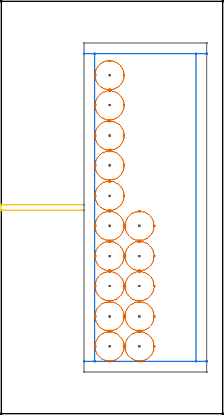
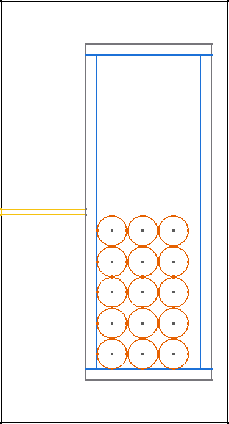
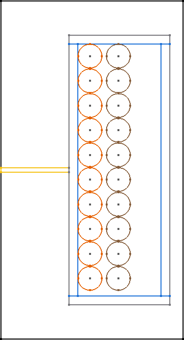

Winding types
=======================================

+---------------------------------------------+---------------------------------------+-------------------------------------------+
| **Single_Square**                           | **Single Hexagonal**                  | **Single Full**                           |
+---------------------------------------------+---------------------------------------+-------------------------------------------+
| |image0|                                    | |image1|                              | |image2|                                  |
+---------------------------------------------+---------------------------------------+-------------------------------------------+
| **Single_SquareFullWidth**                  | **Single FoilHorizontal**             | **Single FoilVertical (fixed thickness)** |
+---------------------------------------------+---------------------------------------+-------------------------------------------+
| |image3|                                    | |image4|                              | |image5|                                  |
+---------------------------------------------+---------------------------------------+-------------------------------------------+
| **Single FoilVertical (interpolate)**       | **Interleaved HorizontalAlternating** | **Interleaved VerticalStacked (square)**  |
+---------------------------------------------+---------------------------------------+-------------------------------------------+
| |image6|                                    | |image7|                              | |image8|                                  |
+---------------------------------------------+---------------------------------------+-------------------------------------------+
| **Interleaved VerticalStacked (hexagonal)** |                                       |                                           |
+---------------------------------------------+---------------------------------------+-------------------------------------------+
| |image9|                                    |                                       |                                           |
+---------------------------------------------+---------------------------------------+-------------------------------------------+

.. |image1| image:: ../images/winding_types/Single_Hexagonal.png
	:width: 250
.. |image2| image:: ../images/winding_types/Single_Full.png
	:width: 250

.. |image4| image:: ../images/winding_types/Single_FoilHorizontal.png
	:width: 250
.. |image5| image:: ../images/winding_types/Single_FoilVertical_fixed_thickness.png
	:width: 250
.. |image6| image:: ../images/winding_types/Single_FoilVertical_interpolate.png
	:width: 250

.. |image8| image:: ../images/winding_types/Interleaved_VerticalStacked_square.png
	:width: 250
.. |image9| image:: ../images/winding_types/Interleaved_VerticalStacked_hexagonal.png
	:width: 250