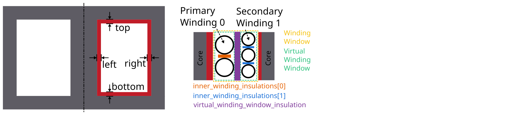

# User Guide: How to create a FEMMT model

This guide explains how a model can be created in femmt and provides all the
necessary information to work with femmt.
Many examples for femmt models can be found in the example folder.

## 1. Working directory

Every femmt model has a working directory which can be set when creating an instance of the femmt base class called 'MagneticComponent'.
When running the simulation many files will be created in the working directory including the model, mesh and multiple result files. It also contains the electro_magnetic_log.json which the most important simulation results (e.g. losses, inductance, ...).

Besides the working directory a MagneticComponent also needs a ComponentType.
Currently this can be 'Inductor', 'Transformer' or 'IntegratedTransformer'.

## 2. Creating a core
In general, only 2D rotationally symmetric geometries are represented in FEMMT. Other core shapes must first be converted to a 2D rotationally symmetric shape. The corresponding values for this (diameter core, dimensions of the winding window) are taken from the data sheet. Afterwards, a corresponding geometry is generated automatically. 

The following graphics always show only a sectional view of the core geometry. 

After creating a MagneticComponent a core needs to be created. The core needs spatial parameters as well as material parameters.
The neccessary spatial parameters are shown in the image below.

### Material database

TODO

## 3. Adding air gaps to the core

In the next steps air gaps can be added. Currently it is only possible to add
air gaps in the center leg, there for the 'AirGapLegPosition' is always 'CenterLeg'.
To set the vertical position for a air gap multiple methods are available:
- **Center**: The air gap will always be positioned in the center
- **Percent**: A value between 0 and 100 can be given. Where 0 represents the bottom end and 100 the top end of the winding window.
- **Manually**: The specific y coordinate nneeds to be entered manually.

## 4. Set insulation distances

There are multiple insulations implemented in femmt. Some of them are created as rectangles in the model, some are just adding an offset to the windings.

Core insulations are the insulations which are created as rectangles in the model. 4 core insulations will be added: top, left, bottom, right.
The distance of those values can be set with the 'add_core_isolations' function.

Furthermore there are offset insulations between each turn in the same winding,
a distance between 2 windings in one virtual winding window and a distance between each virtual winding window. The first two are set using the 'add_winding_isolations' functions, the last one when creating such a virtual winding window (vww).

## 5. Add windings to the winding window

In order to understand the way winding windows work in femmt, the concept of virtual winding windows must be explained:

### Virtual Winding Windows

For every femmt model there is always one winding window, which is a 2D representation of the 3D rotated winding window. This winding window can be split into multiple virtual winding windows which are used to draw the conductors.
There are multiple ways to split a winding window:
- **NoSplit**: Only 1 virtual winding window will be returned and it has the same size as the real winding window.
- **HorizontalSplit**: 2 virtual winding windows will be returned, one for the top and one for the bottom part. The height of the splitting line can be set using a horizontal_split_factor (value between 0 and 1)
- **VerticalSplit**: 2 virtual winding windows will be returned, one for the left and one for the right part. The radius (x-coordinate) of the splitting line can be set using a vertical_split_factor (value between 0 and 1)
- **HorizontalAndVerticalSplit**: 4 virtual winding windows are returned. One for each corner (in the following order): top_left, top_right, bottom_left, bottom_right. In this case the horizontal and vertical split factors can be used to set the sizes of each grid cell.

In addition to that 2 virtual winding windows can be combined to one (this is not possible for (top_left, bottom_right) or (top_right, bottom_left) combinations). This is done using the combine_vww() function of the WindingWindow class.

Each virtual winding window can be filled with either one single winding or one interleaved winding.

### Winding types and winding schemes

The following table gives an overview of the different winding types, winding schemes and conductor arrangements:

| **WindingType** | **ConductorType** | **WindingScheme** | **ConductorArrangement** | **WrapParaType** | **status** | **description** |
| --- | --- | --- | --- | --- | --- | --- |
| Interleaved | | | | | | Always needs 2 conductors |
| | RoundSolid, RoundLitz | 
| | | Bifilar | | | not implemented | TODO |
| | | VerticalAlternating | | | not implemented | primary and secondary winding are interleaved vertically (rows)
| | | HorizontalAlternating | | | implemented | primary and secondary winding are interleaved horizontally (cols)
| | | VerticalStacked | | | implemented | primary winding is drawn bottom to top, seoncdary winmding is drawn top to bottom
| | | | Square | | " |
| | | | Hexagonal | | " |
| | RectangularSolid | | | | not implemented |
| Single | | | | | | Always needs 1 conductor | 
| | RoundSolid, RoundLitz |
| | | None | | | implemented |
| | | | Square | | " |
| | | | Square full width | | " |
| | | | Hexagonal | | " | 
| | RectangularSolid |
| | | Full | | | implemented | whole virtual winding window contains is filled with one turn
| | | FoilHorizontal (stacked) | | | implemented | foils are very long (x-axis) and drawn along y-axis
| | | Square full width | | | not implemented | foils are drawn along x-axis first and then along y-axis
| | | FoilVertical | | | implemented | foils are very high (y-axis) and drawn along x-axis
| | | | | Fixed Thickness | " |
| | | | | Interpolate | " |

#### ConductorArrangement
- **Square**: conductors are set in next to each other in a grid
- **Hexagonal**: similar to square but in this case the conductors frpmo the next column slips in the free space between two conductors from the first column
- **Square full width**: conducors are first drawn along x-axis and then y-axis

#### WrapParaType
- **Fixed thickness**: TODO
- **Interpolate**: TODO

An image for the possible winding types is [here](winding_types.md).

## 6. Add conductors

When creating an instance of the class Conductor a winding number and a conductivity needs to be given:

The winding number represents the index of the winding (e.g. primary->1, secondary->2, tertiary->3).
As an example: When starting a simulation on a transformer a current needs to be given, this is done in a list.
The first index of the current's list will be set to the winding with the lowest winding number, the second index of the list to the
winding with the second lowest winding number and so on.

The conductivity can be set using the Conductivity enum where one of two possible materials need to be selected:
- **Copper**
- **Aluminium**

After creating an conductor object it is necessary to add a conductor to it.
As already shown in the winding types table 3 different conducors can be set:
- **RoundSolid**
- **RoundLitz**
- **RectangularSolid**

### Add conductors to virtual winding windows

Now the conductors need to be added to the virtual winding windows with the corresponding winding type and winding scheme.
In this case the set_winding() or set_interleaved_winding() function needs to be called. In the set_interleaved_winding() function an
isolation distance can also be set. This value represents the distance between conductors from the primary and secondary side.

## 7. Add components to model

In order for the model to be created every component needs to be added to the MagneticComponent.
The components **Core**, **WindingWindow** are always needed, **AirGaps**, **Isolations**, **StrayPath** are optional.
This is usually done by the set_core(), set_winding_window(), ... functions.

## 8. Create model and start simulation

After every needed component is added to the model the model can be created.
This is done using the create_model() function. The frequency is needed there because of the mesh which is adapted according to the skin depth.
In addition to that a boolean can be given to show the model after creation (in gmsh).

The last step is to run a simulation using single_simulation(), which needs the frequency, currents (and phase if transformer is set) as parameters.
