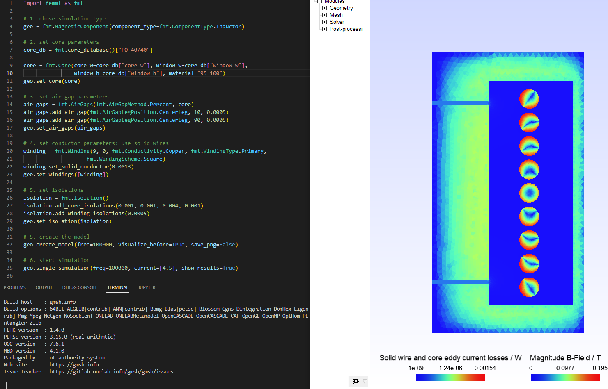

*****************
Examples
*****************

This toolbox is able to build a complete FEM simulation from simple Python code. The following figure shows the Python code on the left and the corresponding FEM simulation on the right.

======
Basics
======
Code examples can be found in this [example file](/femmt/examples/basic_example.py). This file is updated regulary.

The magnetic component can be an inductor, a transformer, or a transformer with integrated stray path. The parameterization process is divided into the following steps:
    1. Chose simulation type,
    2. set core parameters (geometry, material),
    3. set air gap parameters (position, height),
    4. set conductor parameters (litz/solid wire),
    5. start simulation with given frequencies and currents and phases.

Find an example here, and check out the [example file](/femmt/examples/basic_example.py) for more examples!

.. code-block::

	import femmt as fmt
	# 1. chose simulation type
	geo = fmt.MagneticComponent(component_type="inductor")

	# 2. set core parameters
	geo.core.update(window_h=0.03, window_w=0.011,
		            mu_rel=3100, phi_mu_deg=12,
		            sigma=0.6)

	# 3. set air gap parameters
	geo.air_gaps.update(method="center", n_air_gaps=1, air_gap_h=[0.0005], position_tag=[0])

	# 4. set conductor parameters
	geo.update_conductors(n_turns=[[14]], conductor_type=["solid"], conductor_radii=[0.0015],
		                  winding=["primary"], scheme=["square"],
		                  core_cond_isolation=[0.001, 0.001, 0.002, 0.001], cond_cond_isolation=[0.0001],
		                  conductivity_sigma=["copper"])

	# 5. start simulation with given frequency, currents and phases
	geo.create_model(freq=100000)
	geo.single_simulation(freq=100000, current=[3])

The examples contain among other things:
    * Geometries: Coil, transformer, transformer with integrated stray path,
    * wire and stranded wire definition,
    * air gaps definition,
    * excitation with different frequencies, amplitudes and phases.

The simulation results can be found in the file /python-side-packages-path/femmt/femmt/results/result_log_electro_magnetic.json. In it you can find
    * power loss in the core: hysteresis losses and eddy current losses,
    * losses per winding and for each individual winding,
    * self- and mutual inductances.

======
GUI
======

There is a first preview for a GUI. Installing this is a bit cumbersome at first, but will be simplified in the future:
    * Download the complete repository via `Code` -> `Download ZIP` and unpack it.
    * install the development version of femmt as described above
    * run python `downloads/path-to_femmt/femmt/gui/femmt_gui.py`

.. image:: ../../documentation/femmt_gui_definition.png
    :width: 500px
    :align: center
    :alt: FEMMT GUI
